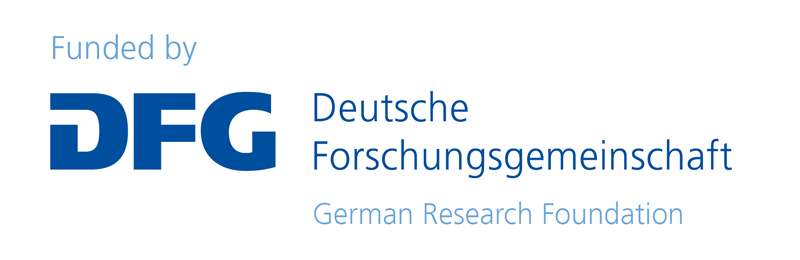

# Quantitative analysis of textual organisation across registers

The **QuanTOR** project is co-funded by DFG (project no. [528467412](https://gepris.dfg.de/gepris/projekt/528467412)) and SNF (grant [218836](https://data.snf.ch/grants/grant/218836)). It is jointly carried out by the [Chair of English Linguistics](https://www.anglistik.rwth-aachen.de/cms/Anglistik/Anglistik-Amerikanistik/~gceu/Anglistische-Sprachwissenschaft/lidx/1/) at RWTH Aachen, the [Chair of Computational Corpus Linguistics](https://www.linguistik.phil.fau.de/) at FAU Erlangen-Nürnberg, and the [Department of Computational Linguistics](https://www.cl.uzh.ch/) at Universität Zürich (UZH). The project runs from 2024 to 2027.

## Summary

> In linguistic research, registers are usually analysed at the level of entire texts, despite the fact that common definitions of register are linked to the situational context. Situations unfold dynamically over time and language users make different choices at different points in this process. As a consequence, texts are linguistically different at the beginning, in the middle and at the end. So far, this dynamic organisation at the sub-textual level is not yet integrated in register studies. This project aims at enriching linguistic register studies with an account of the dynamic nature of registers as well as quantitative methods for studying this phenomenon. Our focus on the temporal dynamics of text organisation requires an approach that is capable of extracting patterns of linguistic features and the underlying (latent) dimensions of variation from short text segments. It also necessitates automatic identification and classification of relevant segments in order to scale to the analysis of very large corpora. In order to achieve these goals, the project adopts a three-pronged approach to corpus analysis, leveraging the respective expertise of its three applicants. Our work programme combines linguistic interpretation, theory development and manual annotation with multivariate quantitative analysis as well as unsupervised and supervised machine learning. To this end, we develop a novel Bayesian version of Geometric Multivariate Analysis, a reliable and fine-grained approach to the investigation of linguistic variation, as well as machine-learning approaches for the segmentation and labelling of texts that apply state-of-the-art neural and statistical language models. In an iterative process, we develop a theory of the dynamics of language use in situational context, a gold standard of manually segmented and labelled texts, the BayesGMA approach for studying multivariate feature distributions in text time, as well as readily applicable language models for automatic text segmentation and labelling. All components and quantitative results are carefully evaluated and validated. The project uses components of the International Corpus of English (ICE), which not only facilitate the analysis of temporal dynamics across a range of different registers – in the spoken and written mode – but also allow us to submit theoretical claims to an empirical test, for instance, concerning the theoretical relationship between genre and register. The results of the computationally supported corpus analysis will provide a new perspective on a theory of register as a dynamic linguistic reflection of human behaviour in situational context, based on quantitative empirical insight, which, in turn, will feed into our understanding of the architecture of language.

|||
